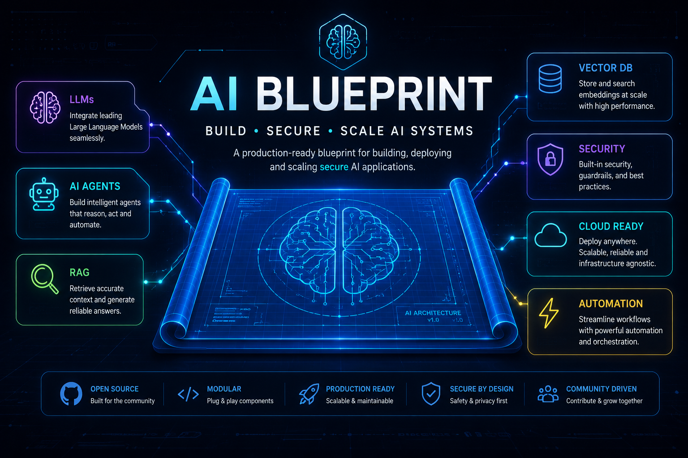

# AI Blueprint

A structured, public knowledge base for learning AI — from math fundamentals to LLMs, RAG, agents, MCP, and interview prep. Organized so it stays navigable as it grows and easy for others to contribute to.

## How to use this repo

- Each numbered folder is a learning track, ordered from foundational (01) to applied/reference (18).
- Every folder has its own `README.md` acting as an index/table of contents for that topic.
- Link-dump sections (papers, videos, tools) use a simple table: `Title | Link | Notes | Date Added`.
- Folder and file names are lowercase-kebab-case for consistency across operating systems.

## Structure

| Folder | What goes here |
|---|---|
| [01-ai-fundamentals](01-ai-fundamentals/README.md) | Math, Python, and core ML concepts needed before anything else |
| [02-machine-learning](02-machine-learning/README.md) | Classical ML algorithms and feature engineering |
| [03-deep-learning](03-deep-learning/README.md) | Neural nets, CNNs, RNNs/LSTMs, Transformers, frameworks |
| [04-llms](04-llms/README.md) | LLM architecture, training/fine-tuning, evaluation, model notes |
| [05-prompt-engineering](05-prompt-engineering/README.md) | Prompting techniques, patterns, worked examples |
| [06-rag](06-rag/README.md) | Retrieval-Augmented Generation concepts, chunking, retrieval |
| [07-vector-databases](07-vector-databases/README.md) | Embeddings, indexing, and specific vector DBs (Pinecone, Weaviate, Chroma, Qdrant, FAISS) |
| [08-ai-agents](08-ai-agents/README.md) | Agent concepts, multi-agent systems |
| [09-mcp](09-mcp/README.md) | Model Context Protocol — servers, clients, concepts |
| [10-langchain](10-langchain/README.md) | LangChain and LangGraph |
| [11-llamaindex](11-llamaindex/README.md) | LlamaIndex |
| [12-ai-security](12-ai-security/README.md) | Prompt injection, jailbreaks, data privacy, security checklists |
| [13-ai-deployment](13-ai-deployment/README.md) | MLOps, cost optimization, serving and scaling |
| [14-projects](14-projects/README.md) | End-to-end applied projects, organized by topic |
| [15-interview-questions](15-interview-questions/README.md) | ML/DL/LLM/system-design/coding interview questions |
| [16-research-papers](16-research-papers/README.md) | Paper summaries and a running reading list |
| [17-videos](17-videos/README.md) | Curated videos, courses, blogs, and tools |
| [18-best-practices](18-best-practices/README.md) | System design and evaluation/testing guidelines |
| [assets](assets/README.md) | Images/diagrams referenced from notes |

## Conventions

- One concept or paper per file where possible — easier to link and search.
- Prefer Markdown for notes; keep code/projects in [14-projects](14-projects/README.md) with a short `README.md` per project explaining what it demonstrates.
- Add new links to the nearest relevant table rather than creating new files for single links.
- `13-ai-deployment` is for shipping/operating AI systems; `18-best-practices` is for design and evaluation guidelines. When in doubt, put "how do I run this in production" content in 13, and "how do I design/test this well" content in 18.

## Contributing

Issues and PRs are welcome — please follow the folder conventions above and keep additions in the matching section rather than creating new top-level folders.
